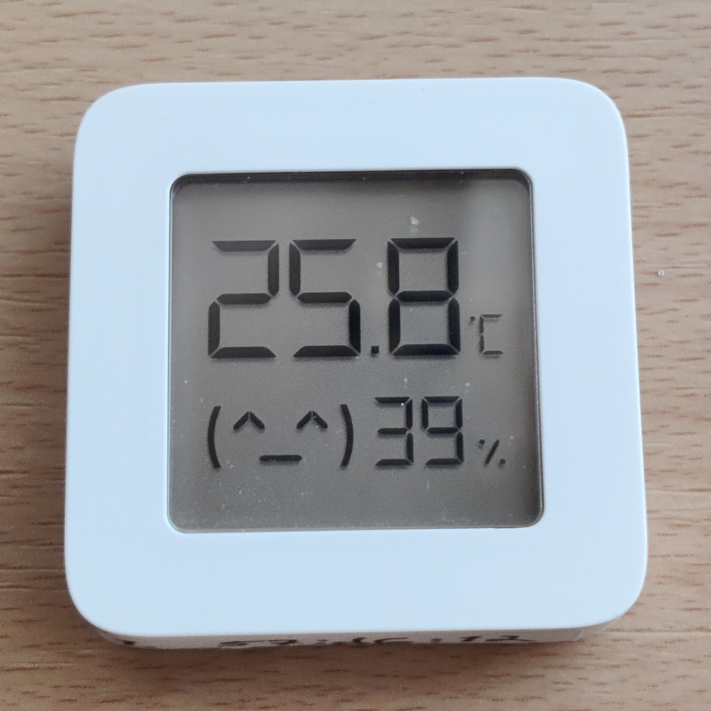

# read-xiaomi-mijia
Bash script to output temperature, humidity and/or battery level from Xiaomi Mijia Bluetooth LE sensors using gatttool from BlueZ protocol stack on Linux.

Sample usage:
```
$ ./read-xiaomi-mijia.sh -b A4:C1:38:03:13:37 -s
23.33 37 99
```
To find your sensors' bluetooth addresses you can run
```
hcitool lescan
```
and look for MACs starting with A4:C1:38.


